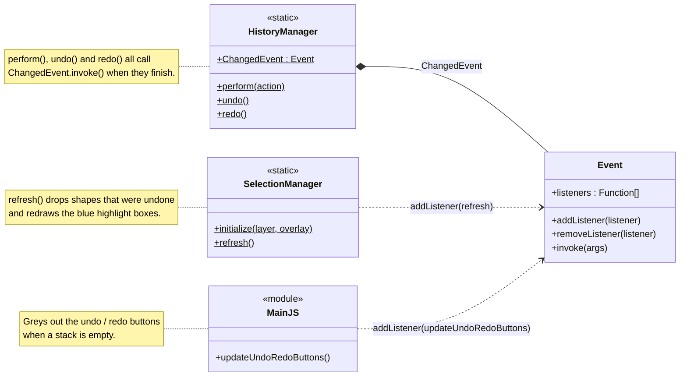
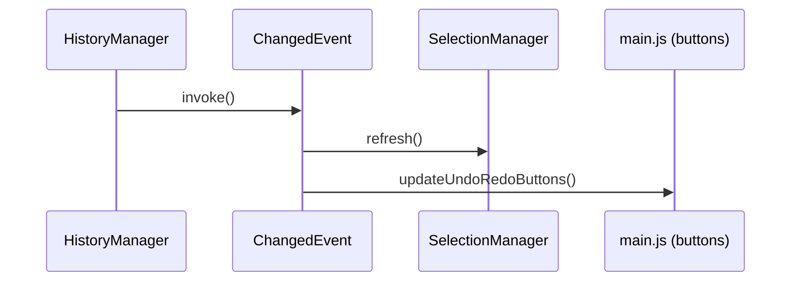

# Observer Pattern

**Files:** `Event.js`, `managers/HistoryManager.js`, `managers/SelectionManager.js`, `main.js`

```mermaid
classDiagram
    direction LR

    class Event {
        +listeners : Function[]
        +addListener(listener)
        +removeListener(listener)
        +invoke(args)
    }

    class HistoryManager {
        <<static>>
        +ChangedEvent : Event$
        +perform(action)$
        +undo()$
        +redo()$
    }

    class SelectionManager {
        <<static>>
        +initialize(layer, overlay)$
        +refresh()$
    }

    class MainJS {
        <<module>>
        +updateUndoRedoButtons()
    }

    HistoryManager *-- Event : ChangedEvent
    SelectionManager ..> Event : addListener(refresh)
    MainJS ..> Event : addListener(updateUndoRedoButtons)

    note for HistoryManager "perform(), undo() and redo() all call<br>ChangedEvent.invoke() when they finish."
    note for SelectionManager "refresh() drops shapes that were undone<br>and redraws the blue highlight boxes."
    note for MainJS "Greys out the undo / redo buttons<br>when a stack is empty."
```

## When the history changes

```mermaid
sequenceDiagram
    participant HM as HistoryManager
    participant E as ChangedEvent
    participant SM as SelectionManager
    participant UI as main.js (buttons)

    HM->>E: invoke()
    E->>SM: refresh()
    E->>UI: updateUndoRedoButtons()
```