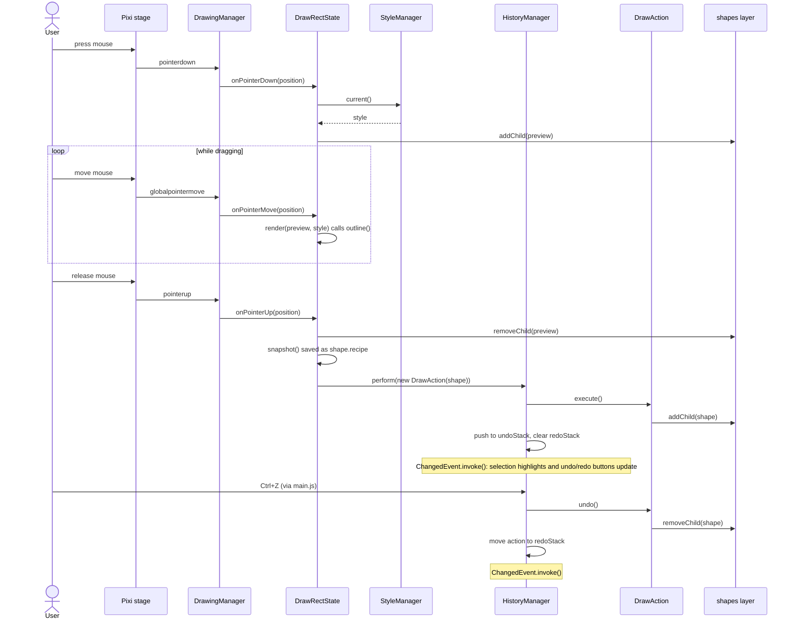

# Sequence: Drawing a Shape, Then Undoing It

Shows the State, Template Method, Command and Observer patterns working together.

```mermaid
sequenceDiagram
    actor User
    participant Stage as Pixi stage
    participant DM as DrawingManager
    participant Tool as DrawRectState
    participant SM as StyleManager
    participant HM as HistoryManager
    participant Act as DrawAction
    participant Layer as shapes layer

    User->>Stage: press mouse
    Stage->>DM: pointerdown
    DM->>Tool: onPointerDown(position)
    Tool->>SM: current()
    SM-->>Tool: style
    Tool->>Layer: addChild(preview)

    loop while dragging
        User->>Stage: move mouse
        Stage->>DM: globalpointermove
        DM->>Tool: onPointerMove(position)
        Tool->>Tool: render(preview, style) calls outline()
    end

    User->>Stage: release mouse
    Stage->>DM: pointerup
    DM->>Tool: onPointerUp(position)
    Tool->>Layer: removeChild(preview)
    Tool->>Tool: snapshot() saved as shape.recipe
    Tool->>HM: perform(new DrawAction(shape))
    HM->>Act: execute()
    Act->>Layer: addChild(shape)
    HM->>HM: push to undoStack, clear redoStack
    Note over HM: ChangedEvent.invoke(): selection highlights and undo/redo buttons update

    User->>HM: Ctrl+Z (via main.js)
    HM->>Act: undo()
    Act->>Layer: removeChild(shape)
    HM->>HM: move action to redoStack
    Note over HM: ChangedEvent.invoke()
```